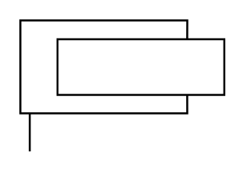

# X11490 Single-acting cylinder,

## Definition

```
{
  _style: { 
    entity: 'verticalLabelPosition=bottom;aspect=fixed;html=1;verticalAlign=top;fillColor=strokeColor;align=center;outlineConnect=0;shape=mxgraph.fluid_power.x11490;points=[[0.047,1,0]]',
  },
  _original_width: 102.14,
  _original_height: 65.4,
}
```

## Usage

```
import { X11490SingleActingCylinder } from '@dinghy/standard-components-diagrams/fluidPower'

<X11490SingleActingCylinder/>
```

## Preview


