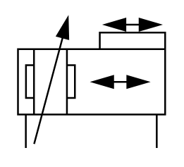

# X11530 Double-acting cable-type

## Definition

```
{
  _style: { 
    entity: 'verticalLabelPosition=bottom;aspect=fixed;html=1;verticalAlign=top;fillColor=strokeColor;align=center;outlineConnect=0;shape=mxgraph.fluid_power.x11530;points=[[0.05,1,0],[0.94,1,0]]',
  },
  _width: 83.5,
  _height: 73.8,
}
```

## Usage

```
import { X11530DoubleActingCableType } from '@diac/standard-components-diagrams/fluidPower'

<X11530DoubleActingCableType/>
```

## Preview


