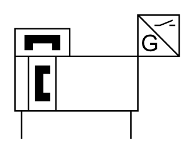

# X11540 Double-acting magnetic-type

## Definition

```
{
  _style: 'verticalLabelPosition=bottom;aspect=fixed;html=1;verticalAlign=top;fillColor=strokeColor;align=center;outlineConnect=0;shape=mxgraph.fluid_power.x11540;points=[[0.04,1,0],[0.705,1,0]]',
  _width: 111.46,
  _height: 84.14,
}
```

## Usage

```
import { X11540DoubleActingMagneticType } from '@reactiac/standard-components-diagrams/fluidPower'

<X11540DoubleActingMagneticType/>
```

## Preview


