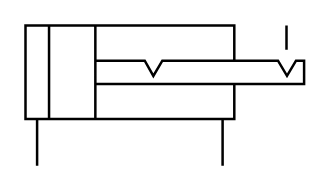

# X11550 Double-acting cylinder

## Definition

```
{
  _style: { 
    entity: 'verticalLabelPosition=bottom;aspect=fixed;html=1;verticalAlign=top;fillColor=strokeColor;align=center;outlineConnect=0;shape=mxgraph.fluid_power.x11550;points=[[0.04,1,0],[0.705,1,0]]',
  },
  _original_width: 111.44,
  _original_height: 56.12,
}
```

## Usage

```
import { X11550DoubleActingCylinder } from '@dinghy/standard-components-diagrams/fluidPower'

<X11550DoubleActingCylinder/>
```

## Preview


