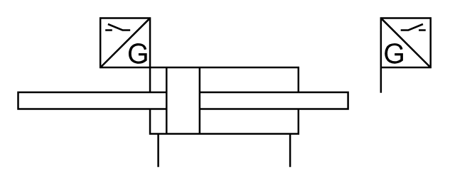

# X11560 Double-acting cylinder,

## Definition

```
{
  _style: { 
    entity: 'verticalLabelPosition=bottom;aspect=fixed;html=1;verticalAlign=top;fillColor=strokeColor;align=center;outlineConnect=0;shape=mxgraph.fluid_power.x11560;points=[[0.34,1,0],[0.66,1,0]]',
  },
  _original_width: 232.08,
  _original_height: 83.92,
}
```

## Usage

```
import { X11560DoubleActingCylinder } from '@diac/standard-components-diagrams/fluidPower'

<X11560DoubleActingCylinder/>
```

## Preview


