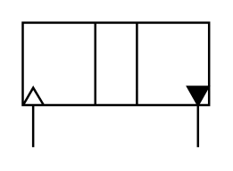

# X11580 Pressure intensifier,

## Definition

```
{
  _style: 'verticalLabelPosition=bottom;aspect=fixed;html=1;verticalAlign=top;fillColor=strokeColor;align=center;outlineConnect=0;shape=mxgraph.fluid_power.x11580;points=[[0.053,1,0],[0.94,1,0]]',
  _width: 83.48,
  _height: 55.9,
}
```

## Usage

```
import { X11580PressureIntensifier } from '@diac/standard-components-diagrams/fluidPower'

<X11580PressureIntensifier/>
```

## Preview


