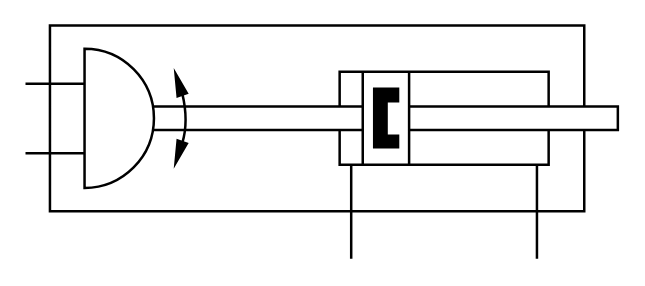

# X11620 Semi-rotary linear

## Definition

```
{
  _style: 'verticalLabelPosition=bottom;aspect=fixed;html=1;verticalAlign=top;fillColor=strokeColor;align=center;outlineConnect=0;shape=mxgraph.fluid_power.x11620;points=[[0,0.25,0],[0,0.55,0],[0.55,1,0],[0.863,1,0]]',
  _width: 236.94,
  _height: 93.28,
}
```

## Usage

```
import { X11620SemiRotaryLinear } from '@diac/standard-components-diagrams/fluidPower'

<X11620SemiRotaryLinear/>
```

## Preview


