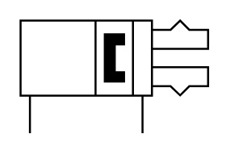

# X11640 Gripper, double-acting

## Definition

```
{
  _style: 'verticalLabelPosition=bottom;aspect=fixed;html=1;verticalAlign=top;fillColor=strokeColor;align=center;outlineConnect=0;shape=mxgraph.fluid_power.x11640;points=[[0.05,1,0],[0.65,1,0]]',
  _width: 92.94,
  _height: 55.82,
}
```

## Usage

```
import { X11640GripperDoubleActing } from '@diac/standard-components-diagrams/fluidPower'

<X11640GripperDoubleActing/>
```

## Preview


