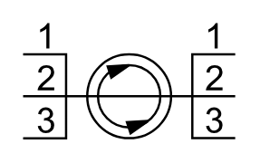

# X11680 Three-way rotary

## Definition

```
{
  _style: 'verticalLabelPosition=bottom;aspect=fixed;html=1;verticalAlign=top;fillColor=strokeColor;align=center;outlineConnect=0;shape=mxgraph.fluid_power.x11680;points=[[0,0.27,0],[0,0.64,0],[0,1,0],[1,0.27,0],[1,0.64,0],[1,1,0]]',
  _width: 93.66,
  _height: 50.86,
}
```

## Usage

```
import { X11680ThreeWayRotary } from '@reactiac/standard-components-diagrams/fluidPower'

<X11680ThreeWayRotary/>
```

## Preview


