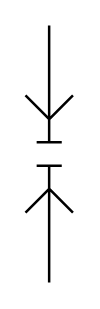

# X11690 Quick-action coupling

## Definition

```
{
  _style: 'verticalLabelPosition=bottom;aspect=fixed;html=1;verticalAlign=top;fillColor=strokeColor;align=center;outlineConnect=0;shape=mxgraph.fluid_power.x11690;points=[[0.5,0,0],[0.5,1,0]]',
  _width: 18.98,
  _height: 102.78,
}
```

## Usage

```
import { X11690QuickActionCoupling } from '@reactiac/standard-components-diagrams/fluidPower'

<X11690QuickActionCoupling/>
```

## Preview


