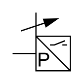

# X11760 Pressure converter

## Definition

```
{
  _style: { 
    entity: 'verticalLabelPosition=bottom;aspect=fixed;html=1;verticalAlign=top;fillColor=strokeColor;align=center;outlineConnect=0;shape=mxgraph.fluid_power.x11760;points=[[0.4,0,0],[0,0.7,0]]',
  },
  _original_width: 46.82,
  _original_height: 47.12,
}
```

## Usage

```
import { X11760PressureConverter } from '@dinghy/standard-components-diagrams/fluidPower'

<X11760PressureConverter/>
```

## Preview


