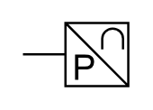

# X11770 Pressure sensor,

## Definition

```
{
  _style: { 
    entity: 'verticalLabelPosition=bottom;aspect=fixed;html=1;verticalAlign=top;fillColor=strokeColor;align=center;outlineConnect=0;shape=mxgraph.fluid_power.x11770;points=[[0,0.5,0]]',
  },
  _width: 46.82,
  _height: 27.96,
}
```

## Usage

```
import { X11770PressureSensor } from '@diac/standard-components-diagrams/fluidPower'

<X11770PressureSensor/>
```

## Preview


