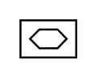

# X11780 Piezo-electric control

## Definition

```
{
  _style: { 
    entity: 'verticalLabelPosition=bottom;aspect=fixed;html=1;verticalAlign=top;fillColor=strokeColor;align=center;outlineConnect=0;shape=mxgraph.fluid_power.x11780;points=[[0,0,0],[0.5,0,0],[1,0,0],[1,0.5,0],[1,1,0],[0.5,1,0],[0,1,0],[0,0.5,0]]',
  },
  _width: 27.76,
  _height: 18.56,
}
```

## Usage

```
import { X11780PiezoElectricControl } from '@diac/standard-components-diagrams/fluidPower'

<X11780PiezoElectricControl/>
```

## Preview


