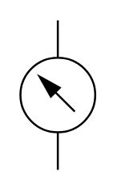

# X11830 Differential-pressure gauge

## Definition

```
{
  _style: 'verticalLabelPosition=bottom;aspect=fixed;html=1;verticalAlign=top;fillColor=strokeColor;align=center;outlineConnect=0;shape=mxgraph.fluid_power.x11830;points=[[0.5,0,0],[0.5,1,0]]',
  _width: 37.34,
  _height: 74.76,
}
```

## Usage

```
import { X11830DifferentialPressureGauge } from '@diac/standard-components-diagrams/fluidPower'

<X11830DifferentialPressureGauge/>
```

## Preview


