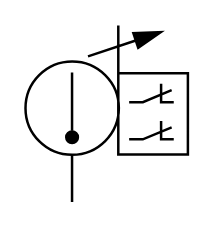

# X11860 Thermometer with

## Definition

```
{
  _style: { 
    entity: 'verticalLabelPosition=bottom;aspect=fixed;html=1;verticalAlign=top;fillColor=strokeColor;align=center;outlineConnect=0;shape=mxgraph.fluid_power.x11860;points=[[0.57,0,0],[0.28,1,0]]',
  },
  _original_width: 64.96,
  _original_height: 70.58,
}
```

## Usage

```
import { X11860ThermometerWith } from '@dinghy/standard-components-diagrams/fluidPower'

<X11860ThermometerWith/>
```

## Preview


