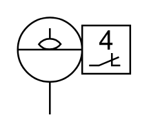

# X11880 Fluid-level switch

## Definition

```
{
  _style: 'verticalLabelPosition=bottom;aspect=fixed;html=1;verticalAlign=top;fillColor=strokeColor;align=center;outlineConnect=0;shape=mxgraph.fluid_power.x11880;points=[[0.28,1,0]]',
  _width: 65.32,
  _height: 56.18,
}
```

## Usage

```
import { X11880FluidLevelSwitch } from '@reactiac/standard-components-diagrams/fluidPower'

<X11880FluidLevelSwitch/>
```

## Preview


