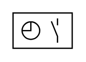

# X11950 Time controller

## Definition

```
{
  _style: 'verticalLabelPosition=bottom;aspect=fixed;html=1;verticalAlign=top;fillColor=strokeColor;align=center;outlineConnect=0;shape=mxgraph.fluid_power.x11950;points=[[0,0,0],[0.5,0,0],[1,0,0],[1,0.5,0],[1,1,0],[0.5,1,0],[0,1,0],[0,0.5,0]]',
  _width: 46.22,
  _height: 27.82,
}
```

## Usage

```
import { X11950TimeController } from '@diac/standard-components-diagrams/fluidPower'

<X11950TimeController/>
```

## Preview


