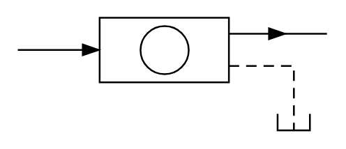

# X11970 In-line particle

## Definition

```
{
  _style: { 
    entity: 'verticalLabelPosition=bottom;aspect=fixed;html=1;verticalAlign=top;fillColor=strokeColor;align=center;outlineConnect=0;shape=mxgraph.fluid_power.x11970;points=[[0,0.29,0],[1,0.145,0],[0.893,1,0]]',
  },
  _original_width: 177.28,
  _original_height: 64.66,
}
```

## Usage

```
import { X11970InLineParticle } from '@dinghy/standard-components-diagrams/fluidPower'

<X11970InLineParticle/>
```

## Preview


