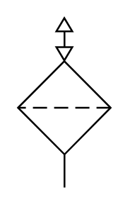

# X11990 Reservoir-breather filter

## Definition

```
{
  _style: 'verticalLabelPosition=bottom;aspect=fixed;html=1;verticalAlign=top;fillColor=strokeColor;align=center;outlineConnect=0;shape=mxgraph.fluid_power.x11990;points=[[0.5,0,0],[0.5,1,0]]',
  _width: 52.44,
  _height: 95.62,
}
```

## Usage

```
import { X11990ReservoirBreatherFilter } from '@reactiac/standard-components-diagrams/fluidPower'

<X11990ReservoirBreatherFilter/>
```

## Preview


