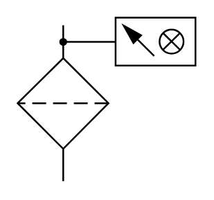

# X12010 Filter with

## Definition

```
{
  _style: { 
    entity: 'verticalLabelPosition=bottom;aspect=fixed;html=1;verticalAlign=top;fillColor=strokeColor;align=center;outlineConnect=0;shape=mxgraph.fluid_power.x12010;points=[[0.255,0.045,0],[0.255,1,0]]',
  },
  _original_width: 102.7,
  _original_height: 94.52,
}
```

## Usage

```
import { X12010FilterWith } from '@dinghy/standard-components-diagrams/fluidPower'

<X12010FilterWith/>
```

## Preview


