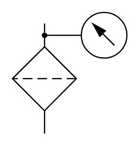

# X12020 Filter with

## Definition

```
{
  _style: 'verticalLabelPosition=bottom;aspect=fixed;html=1;verticalAlign=top;fillColor=strokeColor;align=center;outlineConnect=0;shape=mxgraph.fluid_power.x12020;points=[[0.28,0.09,0],[0.28,1,0]]',
  _width: 93.86,
  _height: 99.22,
}
```

## Usage

```
import { X12020FilterWith } from '@diac/standard-components-diagrams/fluidPower'

<X12020FilterWith/>
```

## Preview


