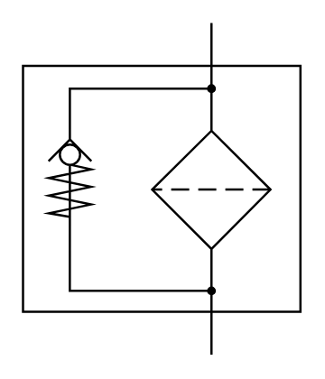

# X12040 Filter with

## Definition

```
{
  _style: 'verticalLabelPosition=bottom;aspect=fixed;html=1;verticalAlign=top;fillColor=strokeColor;align=center;outlineConnect=0;shape=mxgraph.fluid_power.x12040;points=[[0.68,0,0],[0.68,1,0]]',
  _width: 122.92,
  _height: 147,
}
```

## Usage

```
import { X12040FilterWith } from '@diac/standard-components-diagrams/fluidPower'

<X12040FilterWith/>
```

## Preview


