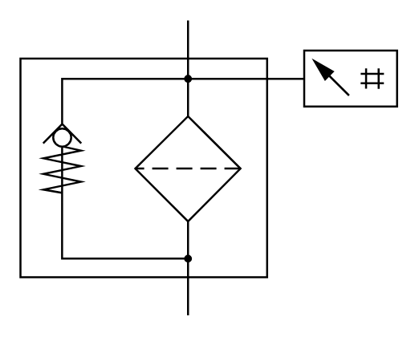

# X12050 Filter with

## Definition

```
{
  _style: { 
    entity: 'verticalLabelPosition=bottom;aspect=fixed;html=1;verticalAlign=top;fillColor=strokeColor;align=center;outlineConnect=0;shape=mxgraph.fluid_power.x12050;points=[[0.445,0,0],[0.445,1,0]]',
  },
  _original_width: 187.68,
  _original_height: 147,
}
```

## Usage

```
import { X12050FilterWith } from '@diac/standard-components-diagrams/fluidPower'

<X12050FilterWith/>
```

## Preview


