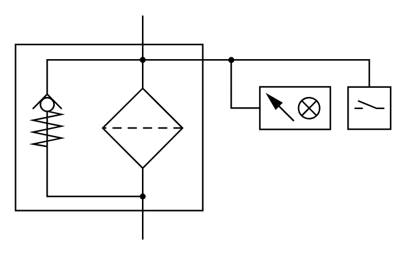

# X12060 Filter with

## Definition

```
{
  _style: 'verticalLabelPosition=bottom;aspect=fixed;html=1;verticalAlign=top;fillColor=strokeColor;align=center;outlineConnect=0;shape=mxgraph.fluid_power.x12060;points=[[0.34,0,0],[0.34,1,0]]',
  _width: 246.26,
  _height: 147,
}
```

## Usage

```
import { X12060FilterWith } from '@reactiac/standard-components-diagrams/fluidPower'

<X12060FilterWith/>
```

## Preview


