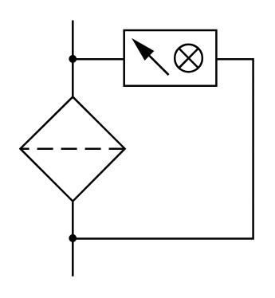

# X12070 Filter with

## Definition

```
{
  _style: 'verticalLabelPosition=bottom;aspect=fixed;html=1;verticalAlign=top;fillColor=strokeColor;align=center;outlineConnect=0;shape=mxgraph.fluid_power.x12070;points=[[0.225,0,0],[0.225,1,0]]',
  _width: 116.84,
  _height: 128.54,
}
```

## Usage

```
import { X12070FilterWith } from '@diac/standard-components-diagrams/fluidPower'

<X12070FilterWith/>
```

## Preview


