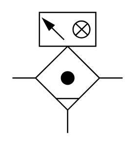

# X12110 Coalescing filter

## Definition

```
{
  _style: { 
    entity: 'verticalLabelPosition=bottom;aspect=fixed;html=1;verticalAlign=top;fillColor=strokeColor;align=center;outlineConnect=0;shape=mxgraph.fluid_power.x12110;points=[[0,0.543,0],[1,0.543,0],[0.5,1,0]]',
  },
  _width: 90.42,
  _height: 99.1,
}
```

## Usage

```
import { X12110CoalescingFilter } from '@diac/standard-components-diagrams/fluidPower'

<X12110CoalescingFilter/>
```

## Preview


