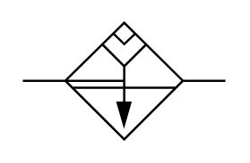

# X12130 vacuum separator

## Definition

```
{
  _style: 'verticalLabelPosition=bottom;aspect=fixed;html=1;verticalAlign=top;fillColor=strokeColor;align=center;outlineConnect=0;shape=mxgraph.fluid_power.x12130;points=[[0,0.5,0],[1,0.5,0]]',
  _width: 90.42,
  _height: 52.4,
}
```

## Usage

```
import { X12130VacuumSeparator } from '@reactiac/standard-components-diagrams/fluidPower'

<X12130VacuumSeparator/>
```

## Preview


