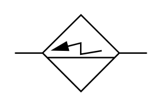

# X12140 Electrostatic separator

## Definition

```
{
  _style: { 
    entity: 'verticalLabelPosition=bottom;aspect=fixed;html=1;verticalAlign=top;fillColor=strokeColor;align=center;outlineConnect=0;shape=mxgraph.fluid_power.x12140;points=[[0,0.5,0],[1,0.5,0]]',
  },
  _original_width: 90.42,
  _original_height: 52.4,
}
```

## Usage

```
import { X12140ElectrostaticSeparator } from '@diac/standard-components-diagrams/fluidPower'

<X12140ElectrostaticSeparator/>
```

## Preview


