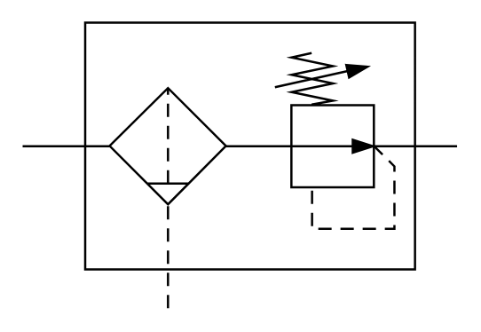

# X12150 Filter with

## Definition

```
{
  _style: 'verticalLabelPosition=bottom;aspect=fixed;html=1;verticalAlign=top;fillColor=strokeColor;align=center;outlineConnect=0;shape=mxgraph.fluid_power.x12150;points=[[0,0.43,0],[1,0.43,0],[0.335,1,0]]',
  _width: 195.82,
  _height: 128.7,
}
```

## Usage

```
import { X12150FilterWith } from '@reactiac/standard-components-diagrams/fluidPower'

<X12150FilterWith/>
```

## Preview


