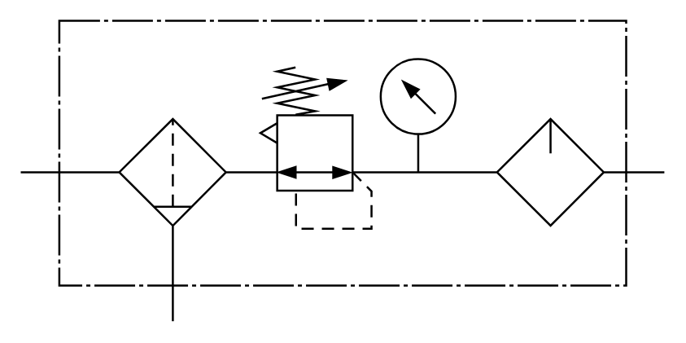

# X12160 Air conditioning

## Definition

```
{
  _style: { 
    entity: 'verticalLabelPosition=bottom;aspect=fixed;html=1;verticalAlign=top;fillColor=strokeColor;align=center;outlineConnect=0;shape=mxgraph.fluid_power.x12160_detailed;points=[[0,0.505,0],[1,0.505,0],[0.236,1,0]]',
  },
  _original_width: 316.36,
  _original_height: 147.46,
}
```

## Usage

```
import { X12160AirConditioning } from '@diac/standard-components-diagrams/fluidPower'

<X12160AirConditioning/>
```

## Preview


