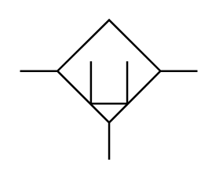

# X12210 Adsorber filter

## Definition

```
{
  _style: 'verticalLabelPosition=bottom;aspect=fixed;html=1;verticalAlign=top;fillColor=strokeColor;align=center;outlineConnect=0;shape=mxgraph.fluid_power.x12210;points=[[0,0.365,0],[1,0.365,0],[0.5,1,0]]',
  _width: 90.42,
  _height: 71.34,
}
```

## Usage

```
import { X12210AdsorberFilter } from '@reactiac/standard-components-diagrams/fluidPower'

<X12210AdsorberFilter/>
```

## Preview


