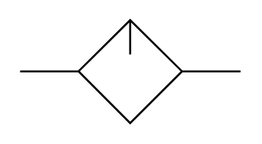

# X12240 Lubricator

## Definition

```
{
  _style: { 
    entity: 'verticalLabelPosition=bottom;aspect=fixed;html=1;verticalAlign=top;fillColor=strokeColor;align=center;outlineConnect=0;shape=mxgraph.fluid_power.x12240;points=[[0,0.5,0],[1,0.5,0]]',
  },
  _original_width: 111.7,
  _original_height: 52.4,
}
```

## Usage

```
import { X12240Lubricator } from '@dinghy/standard-components-diagrams/fluidPower'

<X12240Lubricator/>
```

## Preview


