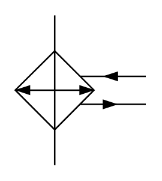

# X12270 Cooler with

## Definition

```
{
  _style: 'verticalLabelPosition=bottom;aspect=fixed;html=1;verticalAlign=top;fillColor=strokeColor;align=center;outlineConnect=0;shape=mxgraph.fluid_power.x12270;points=[[0.302,0,0],[0.302,1,0],[1,0.41,0],[1,0.595,0]]',
  _width: 87,
  _height: 99.6,
}
```

## Usage

```
import { X12270CoolerWith } from '@reactiac/standard-components-diagrams/fluidPower'

<X12270CoolerWith/>
```

## Preview


