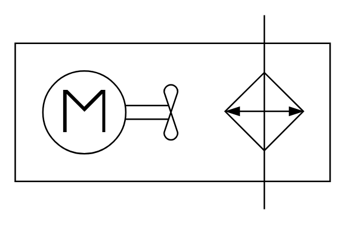

# X12280 Cooler with

## Definition

```
{
  _style: { 
    entity: 'verticalLabelPosition=bottom;aspect=fixed;html=1;verticalAlign=top;fillColor=strokeColor;align=center;outlineConnect=0;shape=mxgraph.fluid_power.x12280;points=[[0.791,0,0],[0.791,1,0]]',
  },
  _width: 211.14,
  _height: 130.4,
}
```

## Usage

```
import { X12280CoolerWith } from '@diac/standard-components-diagrams/fluidPower'

<X12280CoolerWith/>
```

## Preview


