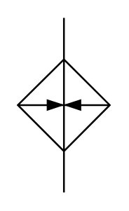

# X12290 Heater

## Definition

```
{
  _style: 'verticalLabelPosition=bottom;aspect=fixed;html=1;verticalAlign=top;fillColor=strokeColor;align=center;outlineConnect=0;shape=mxgraph.fluid_power.x12290;points=[[0.5,0,0],[0.5,1,0]]',
  _width: 52.44,
  _height: 99.6,
}
```

## Usage

```
import { X12290Heater } from '@reactiac/standard-components-diagrams/fluidPower'

<X12290Heater/>
```

## Preview


