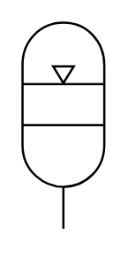

# X12340 Gas-loaded accumulator

## Definition

```
{
  _style: { 
    entity: 'verticalLabelPosition=bottom;aspect=fixed;html=1;verticalAlign=top;fillColor=strokeColor;align=center;outlineConnect=0;shape=mxgraph.fluid_power.x12340;points=[[0.5,1,0]]',
  },
  _original_width: 37.06,
  _original_height: 92.92,
}
```

## Usage

```
import { X12340GasLoadedAccumulator } from '@diac/standard-components-diagrams/fluidPower'

<X12340GasLoadedAccumulator/>
```

## Preview


