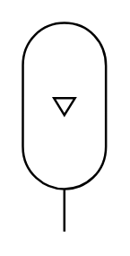

# X12350 Gas bottle

## Definition

```
{
  _style: 'verticalLabelPosition=bottom;aspect=fixed;html=1;verticalAlign=top;fillColor=strokeColor;align=center;outlineConnect=0;shape=mxgraph.fluid_power.x12350;points=[[0.5,1,0]]',
  _width: 37.06,
  _height: 92.92,
}
```

## Usage

```
import { X12350GasBottle } from '@reactiac/standard-components-diagrams/fluidPower'

<X12350GasBottle/>
```

## Preview


