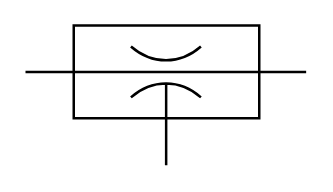

# X12380 Vacuum generator

## Definition

```
{
  _style: 'verticalLabelPosition=bottom;aspect=fixed;html=1;verticalAlign=top;fillColor=strokeColor;align=center;outlineConnect=0;shape=mxgraph.fluid_power.x12380;points=[[0,0.335,0],[1,0.335,0],[0.5,1,0]]',
  _width: 112.26,
  _height: 55.92,
}
```

## Usage

```
import { X12380VacuumGenerator } from '@diac/standard-components-diagrams/fluidPower'

<X12380VacuumGenerator/>
```

## Preview


