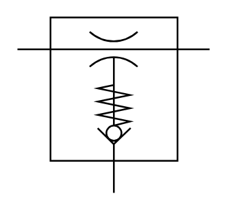

# X12390 Single stage

## Definition

```
{
  _style: 'verticalLabelPosition=bottom;aspect=fixed;html=1;verticalAlign=top;fillColor=strokeColor;align=center;outlineConnect=0;shape=mxgraph.fluid_power.x12390;points=[[0,0.18,0],[1,0.18,0],[0.5,1,0]]',
  _width: 112.26,
  _height: 102.36,
}
```

## Usage

```
import { X12390SingleStage } from '@reactiac/standard-components-diagrams/fluidPower'

<X12390SingleStage/>
```

## Preview


