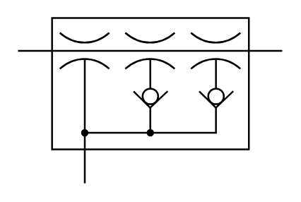

# X12400 Three stage

## Definition

```
{
  _style: 'verticalLabelPosition=bottom;aspect=fixed;html=1;verticalAlign=top;fillColor=strokeColor;align=center;outlineConnect=0;shape=mxgraph.fluid_power.x12400;points=[[0,0.195,0],[1,0.195,0],[0.25,1,0]]',
  _width: 149.6,
  _height: 93.58,
}
```

## Usage

```
import { X12400ThreeStage } from '@reactiac/standard-components-diagrams/fluidPower'

<X12400ThreeStage/>
```

## Preview


