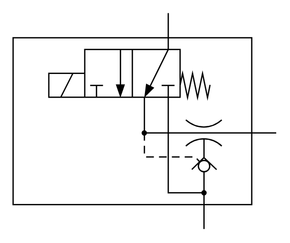

# X12410 Single stage

## Definition

```
{
  _style: 'verticalLabelPosition=bottom;aspect=fixed;html=1;verticalAlign=top;fillColor=strokeColor;align=center;outlineConnect=0;shape=mxgraph.fluid_power.x12410;points=[[0.59,0,0],[0.725,1,0],[1,0.555,0]]',
  _width: 204.68,
  _height: 168.08,
}
```

## Usage

```
import { X12410SingleStage } from '@diac/standard-components-diagrams/fluidPower'

<X12410SingleStage/>
```

## Preview


