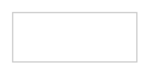

# Dropdown Button (Editable)

## Definition

```
{
  _style: { 
    entity: 'dashed=0;align=center;fontSize=12;shape=rect;fillColor=#ffffff;strokeColor=#cccccc;',
  },
  _original_width: 100,
  _original_height: 40,
}
```

## Usage

```
import { DropdownButtonEditable } from '@dinghy/standard-components-diagrams/gmdlButtons'

<DropdownButtonEditable/>
```

## Preview


