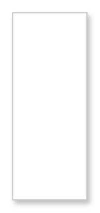

# Dropdown Button (Selected, Editable)

## Definition

```
{
  _style: 'swimlane;shape=rect;strokeColor=#CCCCCC;fillColor=#ffffff;fontColor=#000000;fontStyle=0;childLayout=stackLayout;horizontal=1;startSize=0;horizontalStack=0;resizeParent=1;resizeParentMax=0;resizeLast=0;collapsible=0;marginBottom=0;whiteSpace=wrap;html=1;shadow=1;',
  _width: 0,
  _height: 150,
}
```

## Usage

```
import { DropdownButtonSelectedEditable } from '@reactiac/standard-components-diagrams/gmdlButtons'

<DropdownButtonSelectedEditable/>
```

## Preview


