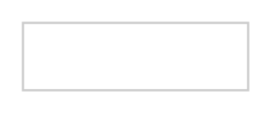

# Dropdown Button

## Definition

```
{
  _style: 'dashed=0;align=center;fontSize=12;shape=rect;fillColor=#ffffff;strokeColor=#cccccc;whiteSpace=wrap;html=1;',
  _width: 100,
  _height: 30,
}
```

## Usage

```
import { DropdownButton } from '@reactiac/standard-components-diagrams/gmdlButtons'

<DropdownButton/>
```

## Preview


