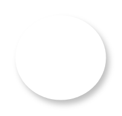

# Floating Action Button 2

## Definition

```
{
  _style: { 
    entity: 'shape=ellipse;dashed=0;strokeColor=none;shadow=1;fontSize=13;align=center;verticalAlign=top;labelPosition=center;verticalLabelPosition=bottom;html=1;aspect=fixed;',
  },
  _original_width: 0,
  _original_height: 56,
}
```

## Usage

```
import { FloatingActionButton2 } from '@dinghy/standard-components-diagrams/gmdlButtons'

<FloatingActionButton2/>
```

## Preview


