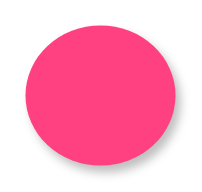

# Floating Action Button

## Definition

```
{
  _style: { 
    entity: 'shape=ellipse;fillColor=#FF4081;strokeColor=none;shadow=1;aspect=fixed;sketch=0;html=1;labelPosition=center;verticalLabelPosition=bottom;align=center;verticalAlign=top;',
  },
  _original_width: 0,
  _original_height: 56,
}
```

## Usage

```
import { FloatingActionButton } from '@diac/standard-components-diagrams/gmdlButtons'

<FloatingActionButton/>
```

## Preview


