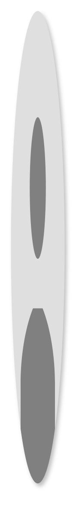

# Floating action buttons 3

## Definition

```
{
  _style: 'dashed=0;html=1;shape=mxgraph.gmdl.user;strokeColor=none;fillColor=#808080;shadow=1;gradientColor=none;sketch=0;hachureGap=4;pointerEvents=0;fontFamily=Architects Daughter;fontSource=https%3A%2F%2Ffonts.googleapis.com%2Fcss%3Ffamily%3DArchitects%2BDaughter;fontSize=20;labelPosition=center;verticalLabelPosition=bottom;align=center;verticalAlign=top;',
  _width: 50,
  _height: 456,
}
```

## Usage

```
import { FloatingActionButtons3 } from '@reactiac/standard-components-diagrams/gmdlButtons'

<FloatingActionButtons3/>
```

## Preview


