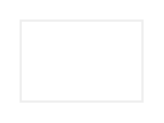

# Persistent Footer Buttons

## Definition

```
{
  _style: { 
    entity: 'swimlane;shape=rect;strokeColor=#EEEEEE;fillColor=#ffffff;fontColor=#2196F3;fontStyle=0;childLayout=stackLayout;horizontal=0;startSize=0;horizontalStack=1;resizeParent=1;resizeParentMax=0;resizeLast=0;collapsible=0;marginBottom=0;whiteSpace=wrap;html=1;',
  },
  _original_width: 0,
  _original_height: 40,
}
```

## Usage

```
import { PersistentFooterButtons } from '@dinghy/standard-components-diagrams/gmdlButtons'

<PersistentFooterButtons/>
```

## Preview


