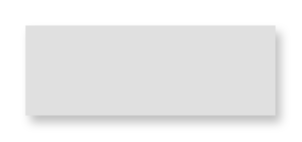

# Raised Button (Focused)

## Definition

```
{
  _style: { 
    entity: 'whiteSpace=wrap;html=1;dashed=0;align=center;fontSize=12;shape=rect;fillColor=#e0e0e0;strokeColor=none;fontStyle=1;shadow=1;',
  },
  _width: 100,
  _height: 36,
}
```

## Usage

```
import { RaisedButtonFocused } from '@diac/standard-components-diagrams/gmdlButtons'

<RaisedButtonFocused/>
```

## Preview


