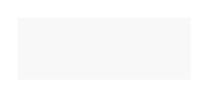

# Raised Button (Hover) 2

## Definition

```
{
  _style: { 
    entity: 'whiteSpace=wrap;html=1;dashed=0;align=center;fontSize=12;shape=rect;fillColor=#cccccc;opacity=15;strokeColor=none;fontStyle=1;fontColor=#ffffff;shadow=0;',
  },
  _original_width: 100,
  _original_height: 36,
}
```

## Usage

```
import { RaisedButtonHover2 } from '@diac/standard-components-diagrams/gmdlButtons'

<RaisedButtonHover2/>
```

## Preview


